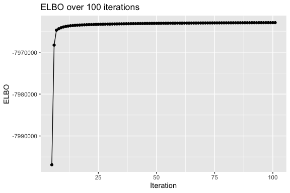

<!-- README.md is generated from README.Rmd. Please edit that file -->
SDA4D
=====

An R package providing an implementation of a variational Bayes algorithm for four dimensional Parallel Factor Analysis.

Installation
------------

You can install the released version of SDA4D from the marchinilab github with

``` r
install.packages('devtools')
devtools::install_github("marchinilab/SDA4D")
```

Example
-------

#### Generating a data tensor

We provide a function to generate a data tensor similar to those we used in simulations, named `generate_example_data` which also returns a list of the matrices used to generate it.

``` r
library(SDA4D)

set.seed(42)
generatedData <- generate_example_data()
 
lapply(generatedData,dim)
#> $dataTensor
#> [1] 200 500  16   3
#> 
#> $A
#> [1] 200   8
#> 
#> $B
#> [1] 3 8
#> 
#> $D
#> [1] 16  8
#> 
#> $X
#> [1]   8 500
```

#### Performing a short run of the tensor decomposition

Now, setting `stopping=FALSE` to ignore the stopping criterion we run the tensor decomposition with the function `RunSDA4D` for 100 iterations as follows:

``` r
 res<-RunSDA4D(data_tensor = generatedData$dataTensor,
               dimn_vector = c(200,500,16,3),
               max_iters = 100,
               num_components = 8,
               stopping=FALSE)
```

Note that we have suppressed the console output from this run in the file here.

In the output we have the evidence lower bound (ELBO, also sometimes referred to as the negative free energy), recorded at each iteration, the maximum number of iterations, and a number of other parameters. Note that in the code we have omitted constant terms from the ELBO.



#### The output

The output of the main function is a list of a number of components:

The main RunSDA4D provides an interface to an implementation of a Bayesian sparse parallel factor analysis model for four-dimensional tensor decomposition. The output therefore consists of a list of the approximate posterior distributions of the main parameters, in the form of their parameters, or point estimates where these were calculated instead.

``` r
names(res)
#>  [1] "ELBO"             "A"                "B"               
#>  [4] "D"                "Lam"              "Beta"            
#>  [7] "Ph"               "Ps"               "Rho"             
#> [10] "WS"               "maximumiteration"
res$maximumiteration
#> [1] 100
length(res$ELBO)
#> [1] 101
```

See the vignette in the doc directory for a description of the output.
